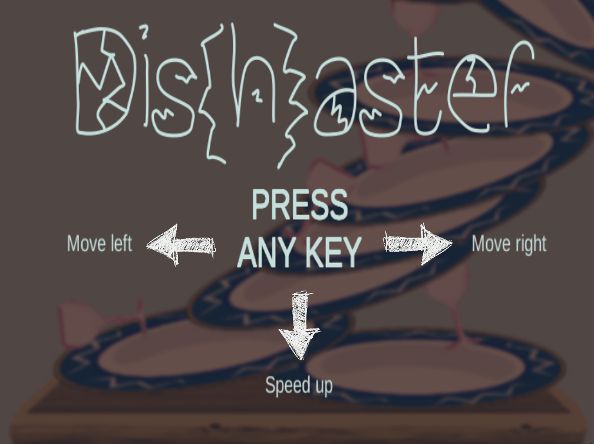

# Dis(h)aster
Help the waiter to stack as many dirty dishes as possible. Go as high as you can!

:video_game: You can find and play the game [here](https://monkog.itch.io/dishaster).

## About

Dishaster is a single player arcade game made with Unity. It can be downloaded and run on Windows or played directly in the browser.

The aim of the game is to stack the falling dishes and collect bonus points. Each fallen piece decreases the remaining life points. They can be restored by collecting hearts. The game ends when the life level reaches 0.  

To navigate the dish use :arrow_left: and :arrow_right: keys, to spped up the dish, use :arrow_down: key.

## :link: Images, fonts, sounds
All external resources used in the game are listed below:

:art: https://pixabay.com/pl/tabela-stolik-kawowy-drewno-575916/  
:art: https://www.deviantart.com/clipartcotttage/art/Goblet-Pink-Png-Clipart-443214095  
:art: http://www.publicdomainfiles.com/show_file.php?id=13545915612553  
:art: https://www.maxpixel.net/Hand-Labor-Next-Arrow-Straight-Right-Turn-2079328  
:art: https://svgsilh.com/image/156706.html  
:art: https://commons.wikimedia.org/wiki/File:Speaker_Icon.svg  
:art: https://commons.wikimedia.org/wiki/File:Mute_Icon.svg  
:art: http://www.publicdomainfiles.com/show_file.php?id=13939155617886  
  
:pencil: https://www.dafont.com/brokenpieces.font  
:pencil: https://www.dafont.com/rh-shmatter.font?psize=l&l[]=10&l[]=1&back=theme  
  
:musical_note: http://soundbible.com/108-Plate-Shatter-Break.html  
:musical_note: http://soundbible.com/1761-Glass-Breaking.html  
:musical_note: http://soundbible.com/474-Magic-Wand-Noise.html  
:musical_note: https://freesound.org/people/E330/sounds/163097/  
:musical_note: https://freesound.org/people/FunWithSound/sounds/412054/
